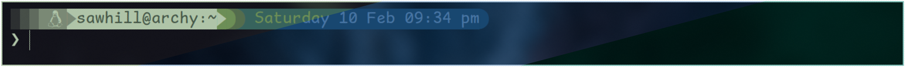
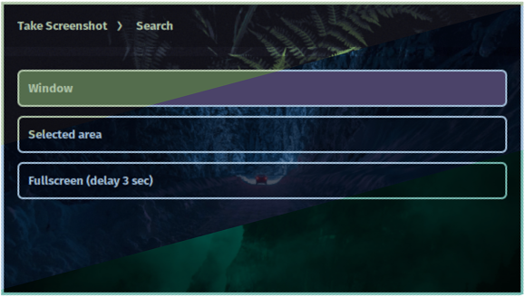
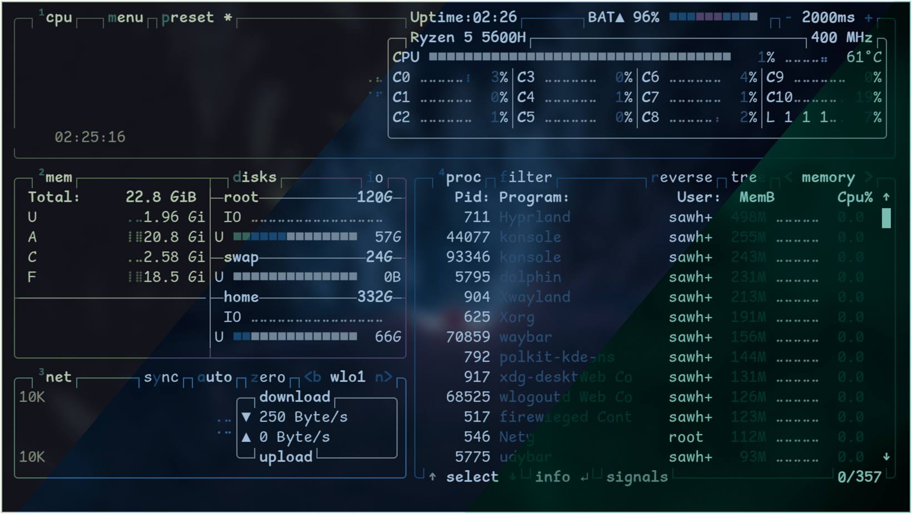
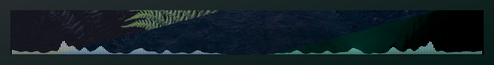

# Dotfiles Repository

> [!NOTE]  
> This repository is in the alpha stage and primarily for personal use. The organization and configurations may change significantly in the future.

## Overview

This repository contains my personal dotfiles and configuration files. It's currently in an early, experimental phase and may not be suitable for general use.

Check [install.md](install.md) for installation instructions.
 
### How it looks:

#### SDDM Pywal Generated Themes

#### Starship Pywal ColorScheme
|||
|-|-|
|||

> [!NOTE]  
> From now on, only a single pywal color scheme is shown to prevent the README from bloating with images.

#### Firefox with Pywal Colorscheme (pywalfox Extension not required)
|||
|---|---|
|||
|||

#### Rofi with Pywal Colorscheme
|||
|---|---|
||
|| |
|||

<small>Please disregard the wallpaper names, as they may not accurately reflect the content of each wallpaper. This discrepancy arises because Microsoft's Vision API did not consistently provide accurate renaming.<small>

#### Btop (System Monitor) | Terminal: Konsole

#### Dolphin File Manager

#### Waybar

#### Dunst

#### Glava

#### Rofi Powermenu (Wlogout Replacement)

#### Wlogout (Replaced with a rofi)

#### Neofetch

(I like this one more tho: Computer are like air conditioners, they stop working efficiently when you open windows but that's messes up my alignments and looks a bit akward)

#### Neovim

