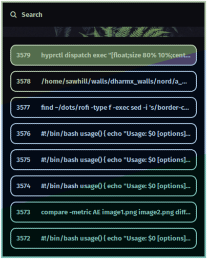

# Dotfiles Repository

> [!NOTE]  
> This repository is in the alpha stage and primarily for personal use. The organization and configurations may change significantly in the future.

> [!Tip]
> The best way to use these dotfiles is to copy specific things that you like, such as the rofi wallpaper view, starship prompt, SDDM theme, some parts of scripts, etc. Or use them as a base for your dots, just as I did with Stephan Rabbe's [dotfiles](https://gitlab.com/stephan-raabe/dotfiles). From there, start customizing them to your requirements. For example, I didn't like the way Stephan's scripts for wallpapers were written, so I tweaked them, along with the waybar theme, etc. I want to emphasize: don't just clone my repo and pull new changes blindly, as they may not work well for you.

## Overview

This repository contains my personal dotfiles and configuration files. It's currently in an early, experimental phase and may not be suitable for general use.

### How it looks:

#### SDDM Pywal Generated Themes
|||
|---|---|
|||
|||

#### Starship Pywal ColorScheme
|||
|-|-|
|||


> [!NOTE]  
> From now on, only a single pywal color scheme is shown to prevent the README from bloating with images.

#### Firefox with Pywal Colorscheme (pywalfox Extension not required)
|||
|---|---|
|||
|||

#### Rofi with Pywal Colorscheme
|||
|---|---|
||
|| |
|||


Ignore the Wallpaper names (they don't reflect wallpaper content as Microsoft's Vision API didn't do a great job renaming them.)

#### Btop (System Monitor) | Terminal: Konsole


#### Dolphin File Manager


#### Waybar


#### Dunst


#### Glava


#### Wlogout (Soon Going to be replaced with a rofi window)


## Installation

1. **Preparing & Booting into Installation Media** 

- First flash a usb stick with arch iso using following command:

    ```bash
    cat arch_iso_file.iso > /dev/sdX 
    ```
    where /dev/sdX is your usb stick. I you want to see progress use commands like pv.

- Boot into arch ISO
- Use follwing commands to connect to internet via WIFI

    ```zsh
    iwctl
    ```

    ```zsh
    station wlanX scan
    ```

    ```zsh
    station wlanX connnect SSID_of_your_WIFI
    ```

2. **Downloading & Running the Installation Script**

- After that enter into bash shell by running.

    ```zsh
    bash
    ```
    Copy the install script to a file using following command:

    ```bash
    curl -fsSL https://raw.githubusercontent.com/Sahil-958/dots/main/insall.sh > install.sh
    ```

    Provide the executable Permission to the file:
    ```bash
    chmod +x install.sh
    ```

    Before running it with ``./install.sh`` check the content of file by ``cat install.sh`` just to make sure that curl didn't return any error in case of wrong URL.
    In future the URL might change so  here is general URL for you to fill: 
   
     ```bash
    curl -fsSL https://raw.githubusercontent.com/user_name/repo_name/branch_name/filename.txt > install.sh
    ```

- After that run the script with ``./install.sh``

3. **Partitioning & Formatting the Installtion Disk **

- Enter the installtion disk e.g. ``/dev/sda``

- Make the paritions using cfdisk, write the newly created parition table, press q to quit cfdisk

- After that enter the root partition e.g. ``/dev/sda3``

- After that enter the home partition e.g. ``/dev/sda4``

- After that enter the swap parition e.g. ``/dev/sda2``

- After that enter y/n to create or skip creation of EFI parition. 

- If y is entered for EFI parition then enter the EFI parition e.g. ``/dev/sda1``

4. **System Configuration**

- After that enter name for your host e.g. ``your_nice_host_name``

- Enter your root password

- Enter username e.g. ``demo_user``

- Enter password for newly created user

5. **Rebooting For Post-installtion**

- After that the script will prompt you to reboot (you can still do most of step without reboot but it's better to reboot)

- Press CTRL-C to interrrup the script and then enter ``exit`` to exit from chroot enviornment and go back to iso 
- After that unmout all the mounted paritions by running

    ```bash
    umount -R /dev/sdX 
    ```
- Enter ``reboot`` to now reboot

- Press F1-F9 (whatever keys that is used to open UEFI boot menu) 

- Select the list item named the same as your hostname set during the installation

6. **Running the Post-installtion Script**

- After booting into the system,run the script again with ``./arch_install3.sh``

- This will start the NetworkManager and open NMTUI to let you connect to the Internet. After connecting via NMTUI, press the ESC button to exit out of it and continue with the script.

- After which the script will install the pikaur (AUR helper) and install the packages from AUR

- Then the script will setup symlinks from the dots folder to .config and all other places

- Now again reboot the system and Enjoy Hyprland.

