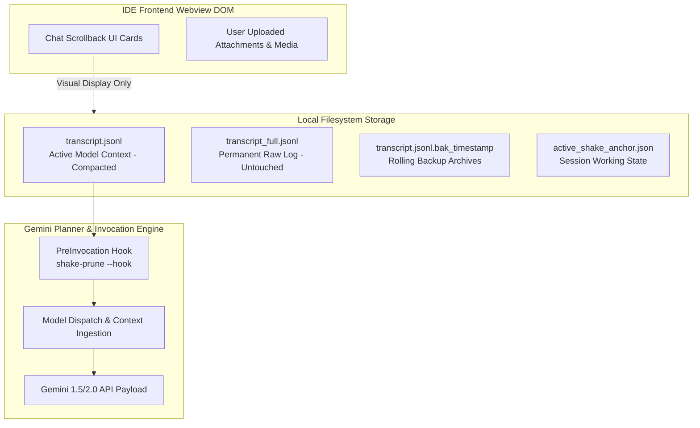

# 🧠 Google Antigravity Agent Lifecycle & Architecture Deep Dive

This document explains the internal mechanics of Google Antigravity (Gemini-powered Advanced Agentic Coding), how context is managed across backend prompt streams versus frontend UI caches, and how `/shake` achieves deterministic, in-place context tree-shaking with zero disruption to the IDE.

---

## 1. Backend Context Stream vs. Frontend UI Cache

A common point of confusion is why an AI agent might "forget" past verbose logs or become faster even though visual scrollback cards remain visible in the editor chat pane.



### The Two Separate Realities

1. **The Model Prompt Stream (`transcript.jsonl`)**:
   - On every single turn, Antigravity reads `<appDataDir>/brain/<conversation-id>/.system_generated/logs/transcript.jsonl` from disk.
   - This file represents the **exact prompt payload** sent across the wire to the Gemini API.
   - If `transcript.jsonl` contains 50,000 lines of `npm test` or `cargo build` logs, those millions of characters are re-serialized and sent to the LLM on **every turn**, causing severe token bloat, high latency, and "attention decay".

2. **The Client Webview DOM Cache**:
   - The IDE interface caches rendered message cards in memory/local webview storage so developers can scroll up and see visual history.
   - **Crucial Distinction**: The LLM *never* sees the frontend DOM cache. It only sees `transcript.jsonl`.

### How `/shake` Operates
`/shake` performs **physical in-place compaction** directly on `transcript.jsonl`:
- It replaces verbose raw tool stdout (`RUN_COMMAND`, `VIEW_FILE`, `write_to_file`) with compact structured receipts:
  `[PRUNED tool=RUN_COMMAND step=42 exit=0 lines=120 archive=/path/to/transcript.jsonl.bak_...]`
- It leaves `transcript_full.jsonl` completely unpruned so developers always have a full raw historical record for auditing.
- It preserves 100% of user prompts, assistant reasoning, and non-zero exit error traces verbatim.
- Because the file's Inode is preserved via truncate-and-rewrite, the IDE's existing open file descriptor continues writing to the compacted file seamlessly.

---

## 2. Inode Preservation Mechanics

Operating systems associate open file descriptors with **Inodes** (Index Nodes), not filenames:

```text
[IDE Process] ---> File Descriptor 12 ---> Inode #84920412 (transcript.jsonl)
```

If a tool uses `fs::rename` (e.g. creating `transcript.tmp` and renaming it to `transcript.jsonl`):
```text
Old File: Inode #84920412 (Unlinked from filesystem, IDE still writes here!)
New File: Inode #91024561 (New transcript.jsonl, orphaned from IDE!)
```
This causes the IDE to continue writing subsequent turns into a deleted Inode, resulting in silent data loss or broken context.

`/shake` uses **POSIX Truncate-and-Rewrite**:
1. `File::options().read(true).write(true).open(path)`
2. `file.lock_exclusive()`
3. `fs::copy(path, backup_path)` (taken under lock)
4. `file.set_len(0)` (resets file length to 0, preserves Inode #84920412)
5. `file.seek(SeekFrom::Start(0))`
6. `file.write_all(compacted_bytes)`
7. `file.sync_all()` (`fsync` ensures data hits physical disk)
8. `file.unlock()`

The IDE's file descriptor remains valid, and the context window is physically compacted with zero disruption.

---

## 3. The PreInvocation Lifecycle Hook

Antigravity provides lifecycle hooks defined in `~/.gemini/config/hooks.json`.

```json
{
  "hooks": {
    "PreInvocation": [
      {
        "command": "shake-prune --hook"
      }
    ]
  }
}
```

On every prompt submission:
1. The IDE executes `shake-prune --hook`, piping session metadata (conversation ID, transcript path, artifact directory) via `stdin`.
2. The hook checks `transcript.jsonl` size. If $\ge 660\text{ KB}$ (~200k tokens), it triggers auto-compaction.
3. If compacted, it injects an ephemeral anchor message into the prompt stream:
   `[Context compacted via /shake. Active state anchored in @... (Step N+). Treat prior raw tool stdout as archived.]`
4. The hook runs with `panic::catch_unwind` protection—if any error occurs, it emits `{}` and exits `0` immediately (fail-open guarantee).
